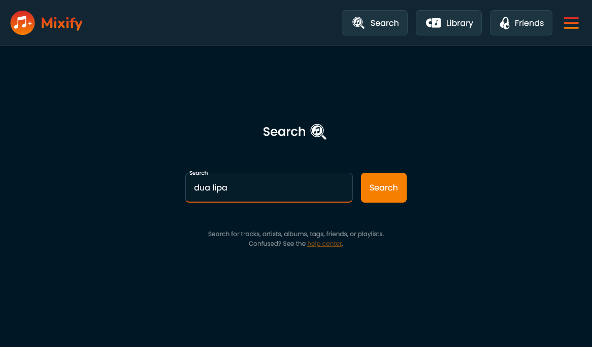
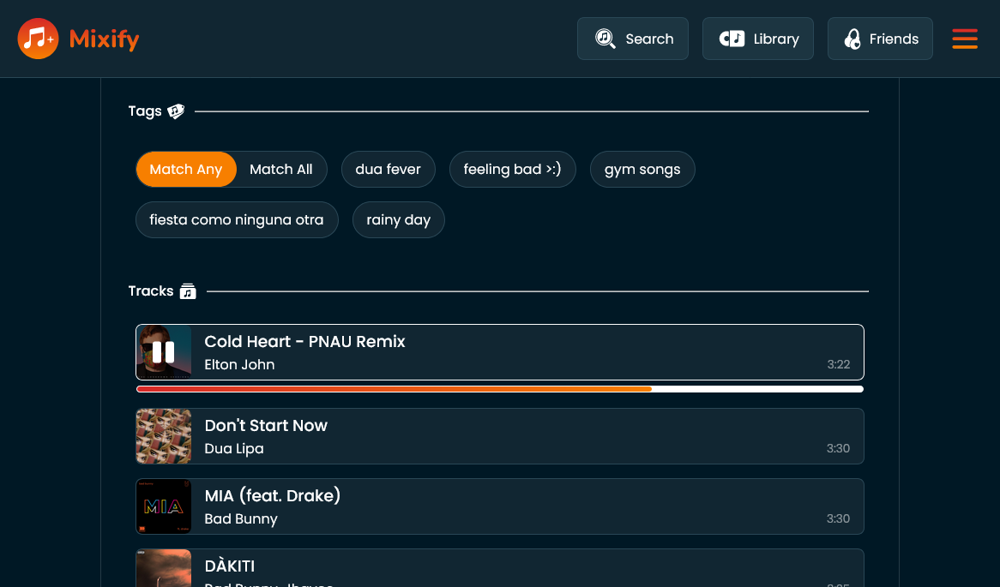

# Mixify

If you are looking for the backend, <a href="https://github.com/njbradley/better-spotify-backend">click</a> here.

## Project Overview

Mixify is a meta-app intended to be a unified layer over existing music streaming services. By signing into Mixify, users can share and collaborate on playlists together even if one uses Spotify, another Apple Music, and a third Youtube.

Mixify also provides a number other benefits, such as a streamlined user interface, and organizing songs by tags rather than playlists. Tags provide a superset of playlist functionality, and they easily allow users to set playback to pull from songs matching any of a list of tags, or all of a list of tags.

## Tech Stack

* React frontend webapp with streamlined UI
* Abstraction layer connecting to Spotify and Apple Music APIs
* Backend for accounts and playlists (Redis or Firebase)

## Database Structure

* Songs table
  * Global, shared across all users
  * Maps song id -> spotify song id, apple music song id

* Users table
  * Username string (required)
  * Email address string (required)
  * List of songs (required)
    * Each song has a song id
    * Each song has a list of custom string tags

  * Spotify permanent token (optional)
  * Spotify hour-long token (optional)
  * Apple authentication token (optional)